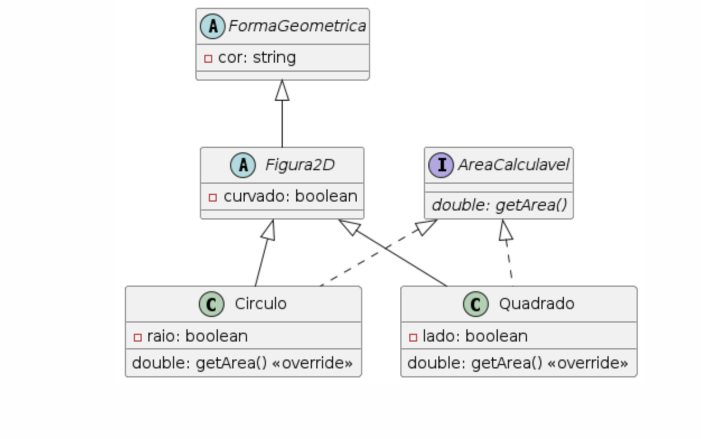

Pacote prova

Este pacote contém classes para representar formas geométricas em duas dimensões, como Círculo e Quadrado. As classes implementam a interface Areaclaculada, que define um método para calcular a área da forma.

Estrutura do Pacote
Interface Areaclaculada

Define o método abstrato getarea() para calcular a área de uma forma geométrica.
java
Copiar código

public interface Areaclaculada {
    public abstract double getarea();
}

Classe FormaGeometrica

Classe abstrata que contém a propriedade cor e métodos acessores.
java
Copiar código

public abstract class FormaGeometrica {
    private String cor;

    public String getCor() {
        return cor;
    }

    public void setCor(String cor) {
        this.cor = cor;
    }
}

Classe Figura2D

Extende FormaGeometrica e adiciona a propriedade curvado.
java
Copiar código
public abstract class Figura2D extends FormaGeometrica {
    private Boolean curvado;

    public Boolean getCurvado() {
        return curvado;
    }

    public void setCurvado(Boolean curvado) {
        this.curvado = curvado;
    }
}

Classe Circulo

Representa um círculo, estende Figura2D e implementa Areaclaculada.
Contém a propriedade raio e implementa o método getarea() para calcular a área do círculo.
java
Copiar código
public class Circulo extends Figura2D implements Areaclaculada {
    private double raio;

    public Circulo(double raio, String cor, Boolean curvado) {
        this.raio = raio;
        super.setCor(cor);
        super.setCurvado(curvado);
    }

    public double getRaio() {
        return raio;
    }

    public void setRaio(double raio) {
        this.raio = raio;
    }

    @Override
    public double getarea() {
        return (raio * raio) * 3.14;
    }
}

Classe Quadrado

Representa um quadrado, estende Figura2D e implementa Areaclaculada.
Contém a propriedade lado e implementa o método getarea() para calcular a área do quadrado.
java
Copiar código
public class Quadrado extends Figura2D implements Areaclaculada {
    private double lado;

    public Quadrado(double lado, String cor, Boolean curvado) {
        this.lado = lado;
        super.setCor(cor);
        super.setCurvado(curvado);
    }

    public double getLado() {
        return lado;
    }

    public void setLado(double lado) {
        this.lado = lado;
    }

    @Override
    public double getarea() {
        return (lado * lado);
    }
}

Classe Main

Classe principal que demonstra o uso das classes acima.
Cria uma lista de objetos Figura2D, adiciona instâncias de Circulo e Quadrado, e imprime suas propriedades.
java
Copiar código
import java.util.ArrayList;

public class Main {
    public static void main(String[] args) {
        ArrayList<Figura2D> lista = new ArrayList<>();

        Circulo figura1 = new Circulo(3, "vermelho", true);
        Quadrado figura2 = new Quadrado(3, "azul", false);

        lista.add(figura1);
        lista.add(figura2);

        for (Figura2D figura : lista) {
            if (figura instanceof Circulo) {
                Circulo circulo = (Circulo) figura;
                System.out.println("Círculo de raio " + circulo.getRaio() + " e cor " + circulo.getCor());
            } else if (figura instanceof Quadrado) {
                Quadrado quadrado = (Quadrado) figura;
                System.out.println("Quadrado de lado " + quadrado.getLado() + " e cor " + quadrado.getCor());
            }
        }
    }
}
